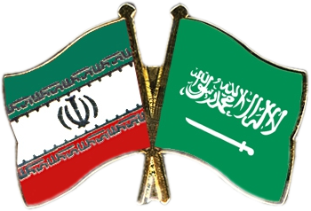

 <a href="../index.md">HOME</a> | <a href="../pages/latest.md">LATEST</a> | <a href="../pages/agitation/index.md">CAMPAIGNS</a> | <a href="../pages/glossary/index.md">GLOSSARY</a>

<h2>News & Analysis &gt; <a href="../news/all/index.md">All</a></h2>

<i>News & analysis from Proletarian Internationalist Notes&mdash;news, reviews and analysis from a global perspective</i>

### U.S. Democrats, Greens keep things simmering with Saudi Arabia

May 31, 2016

Last week, the liberal warmongers at the New York Times came out with a vapid editorial against Saudi Arabia.<a class="note-ref" href="#user-content-note1" name="user-content-noteref1">(1)</a> The point of the editorial board piece is to discourage investment in Saudi Arabia with skepticism about the viability of Saudi Aramco as a publicly traded company and reminders of old criticisms of the Saudi government. Amerikans need to continuously think war against any Middle East country that might stop cooperating with the united $tates is potentially justifiable. The Times editorial serves a purpose in that regard. The gist of the editorial is that the planned privatization of Aramco wouldn't improve the Saudi economy, would be too risky as an opportunity for most foreign investors, and would only enrich bankers, and that buying Aramco shares would regardless be an "an investment in a kingdom that systematically represses women." Repeating what many others in Amerikan media have said countless times in front of Amerikans, the New York Times accused the Saudi government of giving "religious fundamentalists" the "freedom to foster and spread extremist ideology."

No doubt becoming a country with a typical First World economy -- with or without selling Aramco -- would be difficult for Saudi Arabia. That would be because of an accumulation and combination of historical and structural issues involving a world economy in which high-wage, post-industrial rich countries, able to wield the power of finance capital, dominate. But that is not what the New York Times is talking about in the editorial. There is no mention of pan-Arabism, pan-Islamism, pan-Third-Worldism or any strategy to oppose international exploitation or colonialism, cultivate proletarian internationalism, or decrease militarism toward countries not cooperating (or struggling to not cooperate) with the united $tates.

No, what the Times says leaves little room for Saudi Arabia to make progress except by being bombed and spied on by Hillary Clinton for pseudo-feminist reasons. What is Saudi Arabia, which has a need to project an Islamic image as the state responsible for Mecca and Medina, supposed to do in the minds of Amerikan chauvinists if it isn't to open itself more to foreign investors? Just stop producing oil? Discouraging readers from investing when an IPO is going to happen anyway just slows down the process of Saudis getting out of the bloody oil business while contributing to excessive IPO underpricing or undervaluation of Aramco shares among Saudi sovereign wealth holdings. (On the bright side, Amerikans may end up owning less of Aramco if countries with large surpluses see through the propaganda or are more willing to make investments perceived as risky.) Notice there isn't even a single word about Muslim workers in the editorial apart from a skeptical, curiously worded remark about transforming "20 million subjects into self-supporting employers and employees." What we're looking at here is some liberal Amerikans trying to unite with various others including conservative Amerikans to overcome the opposition of "bankers" and prepare for war against another Muslim country on the pretext of saving the females there. In this Times article, there is no pretense at solidarity between AmeriKKKan so-called workers and Muslim workers in other countries. It's another example of the use of gender to unite females and males, "workers" and "capitalists," in the parasitic united $nakes for the purpose of assassinating and killing males in another country or setting aside class differences to bully and overthrow the next Muslim pariah. Amerikans think they, as a so-superior so-unique people, deserve endless chances to overthrow capitalism -- or end the undesirable results of capitalism -- by themselves, but think that change in Muslim countries that actually have a proletariat can only come from the outside or with Western bombs and spies helping a few stooges. And by change they really mean becoming more cooperative with the united $tates or more susceptible to greater oppression. Muslim country gender issues as discussed by Amerikans are just pretexts or represent the viewpoint of privileged Amerikans, male and female.

As if to prove it isn't possible to elect a third-party candidate in the united $tates who isn't a warmonger or militarist, U.$. Green Party "revolutionary" Jill Stein said hours later on Twitter, "The US should not be in the business of buoying up oppressive dictators, like Saudi Arabia, that are sponsoring jihadi terrorism world-over."<a class="note-ref" href="#user-content-note2" name="user-content-noteref2">(2)</a> Stein appeals to anti-war sentiment and talks about decreasing military spending, but needs to remind Amerikans that worthy Amerikkkan candidate Jill Stein still thinks Amerika is superior and has reasons to kill people even if Amerikans apparently choose not to and vote for Stein. Stein couldn't stop at just opposing wars in which the united $tates has various allies, or criticizing Saudi rulers as proxies of Amerikans. "Saudi Arabia" has to be an "oppressive dictator," and not only an oppressive dictator, but one that "sponsors jihadi terrorism" -- "world-over." Stein has talked about not only blocking arms sales to Saudi Arabia, but also taking Saudi assets as others blaming Saudi Arabia for terrorism have proposed.<a class="note-ref" href="#user-content-note3" name="user-content-noteref3">(3)</a> Stein, who has been less willing to call Obama a war criminal, has called Saudis "war criminals" and repeatedly proposed "freezing the bank accounts of countries like Saudi Arabia if they won't stop funding jihadi groups around the world." Stein knows this would be a lot easier than freezing Amerikan officials' and agencies' bank accounts, which Stein never proposes. No matter what the united $tates has done, it always deserves a chance to demonstrate its innate moral superiority as the world's police and bully.

Stein has said removing oil as a justification for war would be a result of greening the economy,<a class="note-ref" href="#user-content-note4" name="user-content-noteref4">(4)</a> But since the wars aren't just about oil imported by the united $tates -- but are about larger economic interests involving countries that would continue importing oil -- the united $tates would continue to try to influence the countries exporting oil, their neighbors, and their partners. While pointing to the movements as consequences of u.$. foreign policy, Stein contributes to the perception of Al Qaeda, ISIS, the Taliban and other movements as threats needing to be dealt with using sanctions, spying, and threats -- which precede choosing "the military option" -- at least. Like Democrats and self-professed socialists with some anti-war, anti-imperialist rhetoric, Greens can fake for a long time. But one day they will show themselves to be phonies, and they already have many times.

In talking about breaking up with Saudi Arabia, Jill Stein has joined those warmongers blaming primarily Saudi Arabia -- rather than Afghanistan and Iraq, which have already been invaded -- for 9/11. Ey has accused the Saudi government itself of funding ISIS and providing weapons to terror groups while suggesting Amerika's responsibility for weapons ending up with terrorists is more indirect or smaller. Saudi Arabia doesn't need weapons from the united $tates of course. The Arab world doesn't need Saudi Arabia to get weapons from the united $tates. The Muslim world and the Third World don't need that. But Amerikans want to extricate the united $tates from Saudi Arabia in a way that is favorable to Amerikans. The same thing could be said about the united $tates' relationship with other countries currently cooperating with it, to which it not only sells weapons but also gives financial aid. U.$. aid to an Islamic country, and cooperation with the united $tates, don't preclude future -- or current -- incursions and occupation contrary to the stupid suggestions of Western atheists and liberals constantly pandering to the Western petty-bourgeoisie. The process by which the united $tates has gone from supporting to invading countries through the sowing of justifications in advance must be frustrated, not accelerated in the guise of "peace over profit."

Among Amerikans, there is a potential for conflict between those who want weapon sales to Saudi Arabia to continue for economic reasons, on the one hand, and those who want to oppose what Saudi Arabia has done to the u.$. oil industry through lower oil prices, or want the united $tates to have more influence in the Middle East than Saudi Arabia is already allowing. In this context, a Forbes Contributor openly said a couple days ago that the united $tates lifted sanctions against Iran as a response to Saudi Arabia's effort to secure market share.<a class="note-ref" href="#user-content-note5" name="user-content-noteref5">(5)</a> The contributor says Saudi Arabia has responded to Iran's own production at lower prices by keeping prices low, but will have to move to increase the prices to support an Aramco IPO -- a privatization necessitated by "the American fracking revolution" in the first place.

It won't be quite like the old days with "American" fully emblazoned in Aramco's name, but part of Aramco will belong to Amerikans within a few years. The Amerikans will have played Iran and Saudi Arabia off against each other masterfully. Government support in the united $tates, financed by the Third World, for fracking has already become a minor detail to be forgotten. The whole notion of energy independence (involving both fracking subsidies and green rhetoric) has contributed to the oil price decline that the united $tates is taking advantage of in various ways. 

The united $tates can have a crisis that it contributed to with its policies, but the crisis won't lead to revolution in the united $tates except maybe fascist revolution. And, the united $tates can weather a crisis better than the Third World and oil-dependent oil-exporting countries. The united $tates swoops in to take advantage. The Dollar Empire causes and then uses crises to further its economic and political interests, uses crisis to portray Amerikan parasites as victims in need of "revolution" that actually perpetuates imperialism, and attacks desperate struggling countries with warmongering and propaganda.

Right now, the situation with Iran-Saudi Arabia relations looks dire with each country publicly accusing the other of supporting terrorism and sectarianism, interfering with Hajj, and ingratiating itself to the Amerikans. Despite (or facilitated by) recriminations of collaborating with Israel, a limited diplomatic pivot toward Israel -- the tail that has been wagged by the Amerikan dog for decades -- appears to be underway.<a class="note-ref" href="#user-content-note6" name="user-content-noteref6">(6)</a> That is if certain signs indicate more than just use of the idea of cooperating with Israel to mobilize or divide public opinion. Yet, an Iranian deputy foreign minister said recently in Tokyo "we are ready to solve our issues with regional countries such as Saudi Arabia through dialog."<a class="note-ref" href="#user-content-note7" name="user-content-noteref7">(7)</a> "He added that Iran regards Saudi Arabia as an important country in the Muslim world."

The interests of Israel and Saudi Arabia aren't identical to the united $tates'. It doesn't mean that Saudi Arabia's rulers aren't rich, or that Israel (largely a country of settler parasites like the united $nakes) isn't an imperialist country illegally occupying Palestine and currently conducting divide-and-conquer with Iran and Saudi Arabia. But in the long run there is a potential for Iran, Israel, Saudi Arabia and other countries, and the "global bankers" the liberal nationalists at the New York Times disdain, to do things together that diverge from what the Amerikans want. That is why the idea of Libya trying to get some relief from Western aggression through third-party diplomacy with Israel in 2011 had a degree of plausibility despite the obvious NATO victory there.<a class="note-ref" href="#user-content-note8" name="user-content-noteref8">(8)</a> Israel's and the united $tates' interests in relation to conflicts in the Middle East aren't exactly the same. Some of the anti-Amerikan or anti-Western movements attacking various Arab, Muslim or Middle East countries have an interesting way of bringing countries together and not always closer to the united $tates. &loz;

<b>Notes:</b> 
<a class="note-no" href="#user-content-noteref1" name="user-content-note1">1.</a> "A Saudi I.P.O.? Buyer beware," 2016 May 27. http://www.nytimes.com/2016/05/27/opinion/a-saudi-ipo-buyer-beware.html?_r=0 
<a class="note-no" href="#user-content-noteref2" name="user-content-note2">2.</a> @DrJillStein, 2:30 PM - 28 May 2016. https://mobile.twitter.com/DrJillStein/status/736670923319869441?p=v 
<a class="note-no" href="#user-content-noteref3" name="user-content-note3">3.</a> "Jill Stein: 'It's crazy to spend $6 trillion on fighting terrorism when we turn blind eye to the Saudis'," 2016 March 8. http://www.mintpressnews.com/jill-stein-crazy-spend-6-trillion-fighting-terrorism-turn-blind-eye-saudis/214549/ 
"Law to enable 9/11 suits vs. Saudi Arabia is right and proper," 2016 May 29. http://edition.cnn.com/2016/05/29/opinions/suing-saudi-arabia-opinion-carter-quinn/ 
"Jill talks with veteran journalist Robert Scheer," 2016 February 22. http://www.jill2016.com/jill_talks_with_veteran_journalist_robert_scheer "I actually do talk about Israel quite a bit. And I often talk about it in the same breath as Saudi Arabia, because we need a consistent policy where we are not carving out exceptions for certain kinds of war criminals and tyrants, whether they’re Saudis or whether it's Netanyahu. We need an international policy based on international law and human rights and diplomacy. So that means we don't supply Israel with $8 million a day to conduct its war crimes against, you know, against Palestine. Period. And same thing for Egypt; you know, they don't get $3 billion a year either, and we don't sell weapons to the Saudis. So you know, we need a consistent policy; this is what's generating the crisis that we cannot spend enough or throw enough weapons into in order to fix." 
"Stein calls on Congress to fight terrorism by halting arms shipments to Saudi Arabia," 2015 November 24. http://www.jill2016.com/halt_us_arm_sales_to_saudi_arabia 
<a class="note-no" href="#user-content-noteref4" name="user-content-note4">4.</a> "Jill Stein's platform more viable than Bernie's," 2016 January 29. http://www.gp.org/jill_stein_s_platform_more_viable_than_bernie_s 
<a class="note-no" href="#user-content-noteref5" name="user-content-note5">5.</a> "Saudi Arabia's second big gamble will take the oil market for a rough ride," 2016 May 29. http://www.forbes.com/sites/panosmourdoukoutas/2016/05/29/saudi-arabias-second-big-gamble-will-take-the-oil-market-for-a-rough-ride/#511be6f023f2 
<a class="note-no" href="#user-content-noteref6" name="user-content-note6">6.</a> "Saudi offers to change stance on Israel: Report," 2016 May 22. http://www.presstv.ir/Detail/2016/05/22/466852/Israel-Saudi-Palestinian-peace-initiative 
"Iran orders Hezbollah to target Saudi Arabia," 2016 May 19. http://saudigazette.com.sa/world/mena/iran-orders-hezbollah-target-saudi-arabia/ 
"Saudi general: 'If Netanyahu accepts the Arab Peace Initiative, we'll open an embassy in Israel'," 2016 April 26. http://www.jpost.com/Arab-Israeli-Conflict/Saudi-general-If-Netanyahu-accepts-the-Arab-Peace-initiative-well-open-an-embassy-in-Israel-452368 
<a class="note-no" href="#user-content-noteref7" name="user-content-note7">7.</a> "Iran ready to settle row with Saudi through talks: Deputy FM," 2016 May 20. http://www.presstv.ir/Detail/2016/05/20/466573/Iran-Japan-Saudi-Arabia-Tokyo-Abbas-Araqchi-JNPC-FEC 
"Yemen's warring sides close to reaching major deal: Report," 2016 May 31. http://www.presstv.ir/Detail/2016/05/31/468299/Yemen-talks-deal-imminent-Kuwait 
<a class="note-no" href="#user-content-noteref8" name="user-content-note8">8.</a> "Analysis: Libya's Gaddafi had a history of reaching out to Israel," 2016 April 14. http://www.jpost.com/Israel-News/Libyas-Gaddafi-had-a-history-of-reaching-out-to-Israel-451214 "Countries such as Saudi Arabia and other Gulf states come to mind as other regimes with possible covert relations with Israel. Perhaps they will disclose some diplomatic surprises in the future." 
"Report: Libya's Gaddafi asked Israel for help during revolution," 2016 April 14. http://www.breakingisraelnews.com/65687/report-libyas-gaddafi-asked-israel-help-during-uprising-middle-east/ 
"In his last days, Gaddafi reportedly turned to Israel for help, was spurned," 2016 April 13, http://www.timesofisrael.com/in-his-last-days-gaddafi-turned-to-israel-for-help-report/ 
"Secret files: US officials aided Gaddafi," 2011 August. http://www.aljazeera.com/indepth/features/2011/08/2011831151258728747.html  
"Libyan leader Gaddafi seeks 'Israel's help'," 2011 March 11. http://gulfnews.com/news/mena/libya/libyan-leader-gaddafi-seeks-israel-s-help-1.774622

_____________________________________ <a href="../index.md">home</a> | <a href="../pages/latest.md">latest</a> | <a href="../pages/agitation/index.md">campaigns</a> | <a href="../reviews/movies/index.md">movie reviews</a> | <a href="../pages/newsletter/index.md">newsletter</a> 

