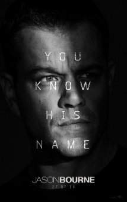

 <a href="../index.md">HOME</a> | <a href="../pages/latest.md">LATEST</a> | <a href="../pages/agitation/index.md">CAMPAIGNS</a> | <a href="../pages/glossary/index.md">GLOSSARY</a>

<h2>Culture/Reviews &gt; <a href="../reviews/movies/index.md">Movies</a></h2>

<i>Movie reviews from Proletarian Internationalist Notes&mdash;news, reviews and analysis from a global perspective</i>

### Beyond patriotism: "Jason Bourne," the individual, and service to u.$. imperialism

"Jason Bourne" 
Dir. Paul Greengrass 
Starring Matt Damon, Tommy Lee Jones, Alicia Vikander, Vincent Cassel, Julia Stiles, Riz Ahmed 
Universal Pictures 
PG-13, 123 minutes, 2016

*Mild spoiler alert*

This continues the successful "Bourne" movie series about CIA blowback and corruption. The last installment, "Legacy," was four years ago -- and about a year before the Black Lives Matter movement began. Some working in the U.S. government of high rank or pay grade have tried to co-opt the hashtag. Watching "Jason Bourne," this writer was reminded of another, old movie about blowback i am fond of but which may have given some Obama supporters the wrong idea, "The Spook Who Sat by the Door" (1973). There is virtually no proletariat to speak of inside U.S. borders, and many non-whites are bought off as internally colonized nationalities, but a wrong idea about the power of the individual as a traitor can actually make things worse for the oppressed in their struggles.

In contrast to "The Spook Who Sat by the Door," the "Bourne" series suggests that Amerikan patriotism is still commendable but focuses on the tortured experience of an individual trying to navigate life, with a deficient sense of self and citizenship, after being involved in CIA operations. These are fictional, Hollywood spy thrillers and most spies sent abroad are able to come back home without being attacked, but no doubt there are many Amerikan spies with identity or memory issues, people who look at the mirror one day and don't recognize themselves, or who would like to think their ideals as youth led (or didn't lead) them to their current situations. It is common in the West to think one has the potential to be better while clinging to a sense of superiority or innocence, or still thinking that one's needs and subjective experiences are more important than many others' even in one's own community. Not wanting to betray one's younger self is its own source of distress. So is not wanting to think the twisted things that one believes one does just for the money (or as supposed infiltration) are actually consistent with one's "social justice" beliefs as youth.

It doesn't have much to do with the unconscious in the film, but "Jason Bourne" raises the idea of the role of the father. Some people in the U.S. intelligence community experience genuine anguish related to their jobs and find themselves talking about family with a psychoanalyst or psychotherapist in the Baltimore-Washington area. I sympathize to an extent as a humyn being, but it also makes a movie like "Jason Bourne" self-indulgent for many. It is as if the hardship of some spies were more important than oppression. One feels that Matt Damon's character is a hero whether eir actions help or hurt anyone else. Maybe we are stuck mentally in the first scenes of "Bourne Identity" (2002) sympathizing with the likable handsome amnesiac just pulled out of the water -- wanting to help and be Bourne's sidekick without knowing anything about what this mysterious helpless-yet-capable persyn has done. Ey is obviously a spy of some kind and a potential enemy, but the appearance of a powerful persyn, in need of care and vulnerable in some situations ideally known only to intimates, has long been attractive to many.

This year, Amerikans will watch several movies or TV series about spies. Lately, there is this idea that "brogrammers" or at least not-too-nerdy hetero males with girlfriends can be spies because of government use for hackers. In other ways -- such as the inclusion of young females as CIA and non-CIA hacker-spies in "Jason Bourne" -- spying is being represented as normal or a career opportunity for ordinary Amerikans. Because so many Amerikans are already employed as spies, "Jason Bourne" will speak to some Amerikan viewers in a very persynal way.

Decades-old "The Spook Who Sat by the Door" is about a former CIA employee and a disciplined underground struggle for New Afrikan liberation. The movie was considered threatening decades ago. In general, however, the idea of infiltrating/joining the CIA or the U.S. State Department in order to make a difference as some kind of anti-imperialist, anti-fascist, anti-racist or feminist is fraught with peril, especially when non-imperialist, oppressed countries targeted by the united $tates are sometimes perceived as fascist or egregious abusers of wimmin in the absence of adequate understanding of global systems. There are conceivably a variety of actions one could take as an amnesiac with elite fighting and spying skills like Jason Bourne's, and the "Bourne" movies set in European countries many Amerikans would like to visit might contribute to contemplation of spying in various ways. It's been half a century since the mid-1960s, when the U.$. working class started being perceived as non-revolutionary even among many Amerikan activists and "Marxists" putting more emphasis on cultural issues. In 2016, there are too many people who think they know why revolutionary movements and uprisings are concentrated in the Third World and, when they get involved more actively in struggles, fuck things up -- as if the CIA hadn't been involved in numerous coups, civil wars, and armed provocations. That is true both of people who join the CIA thinking the united $tates is on the verge of "socialist" "revolution" (so then they may be in "socialist" Amerika's CIA, harmonizing their ideology and occupation), and of people who end up helping the CIA unwittingly.

On the one hand, you have Trotskyists who think Western imperialist countries are progressive because they have influential, so-productive white workers with secular, democratic/republican and union traditions etc., but on the other hand you have phony anti-imperialists and anti-racists/anti-colonialists who think they disagree with the Trotskyists about the so-advanced Western workers and yet somehow end up in the same camp when it comes to toppling Third World capitalist governments that have repressed some leftists. (Jason Bourne's history involves attacking stereotypically corrupt leaders from relatively poor or Third World countries.) This is why synthesis and a whole theory -- and a strategy truly informed by that theory together with concrete analysis -- are important, not just zealous energy around one idea like white workers being racist or Amerikan workers being privileged. The point of saying there isn't much going within the United $tates in terms of revolution and class shouldn't be to justify working through the Democratic Party, pandering to the petty-bourgeoisie in pseudo-feminist, postmodernist and racist ways, or doing international work on behalf of the CIA.

This may be hard for some readers to understand fully, but there are people in the CIA and the State Department who have traveled around the world, developed a global perspective, fallen in love with the people and even the cultures they worked around (to the point of sincerely converting to Islam), and started thinking what's going on internationally -- if not other countries' needs -- may be more important than struggles and concerns inside the united $tates. It's not just an appearance they are putting on, but it doesn't make them friends. Those who don't understand such people exist will find themselves confused and misled. They will eventually learn the hard way when they could have just read some books about spying or diplomacy.

So in "Jason Bourne," we see an example of somebody who seemingly said "fuck it" and decided to live out life making money in underground fighting, after being repeatedly dragged back into struggles they weren't interested in or knew little about. Like others, the movie questions the idea of leaving the CIA and then being able to oppose it. And one can volunteer to work with the CIA, but the choice may involve an illusion. There is no indication that Bourne was anything other than a gung-ho soldier before beginning eir involvement with the CIA, but in the real world the CIA isn't against recruiting people with the most angry- and radical- sounding views/talk if it can control them. Bourne's apathy toward lofty ideological agendas, or disinterest in anything other than eir own survival, is a good thing in this context. People who are ideological or idealistic are useful in certain ways to the CIA. At the same time, there is the usual danger of even a movie like "Jason Bourne" (or any other "Bourne" movie) making clandestine service look adventurous/exciting or glorifying spying by Westerners on behalf of some ideal, or on behalf of some interest that is most likely an Amerikan or NATO interest even when they aren't knowingly spying for an Amerikan/allied service.

<b>Patriotism</b>

"Patriot" is a recurring word in "Jason Bourne." This writer thought of the several definitions of patriotism. In the Amerikan context, patriotism could be fervent devotion to the united $tates before all other countries, loyalty to the u.$. government, obeying one's boss in a chain of command, serving the Amerikan people or doing what one thinks is such service, faithfulness to Amerikan ideals, or just loving Amerika as a country or people. Though the practical significance of the last item is unclear (many around the world would claim to love everyone), it is an important component of what passes for patriotism in the united $tates. Military, spying and other government employment are huge -- but so is sitting on the couch, watching Amerikan football and drinking Amerikan beer as a form of patriotism or worshiping the Amerikan flag at baseball games, without doing much else. Oddly, such may be less patriotic in a sense than the actions of people who aren't even Amerikan acting in the longest-term interests of Amerikans, as humyns threatened by persistent risks of species-dangering catastrophe.

In the spying world, an idea of devotion to one's country is combined with a notion that even the citizens of one's own country wouldn't understand or (along with everyone else) shouldn't be able to know certain things. The actions of the CIA characters played by Alicia Vikander and Tommy Lee Jones in "Jason Bourne" might over time lead to a disdain for large numbers of Amerikans. In the united $tates right now, there is an appearance of nearly half of Amerikans hating the other half. Being able to vote for either candidate who would be willing to kill people using drones and robots, because you think the other half of Amerika is a pile of shit, is a weak basis for patriotism for various reasons. There are also those who believe Amerika is the greatest country in the world, but would admit to hating everyone else in it -- the attitude of many upwardly mobile non-white Amerikan individuals desirous of the privilege of the white master/settler. By contrast, people observing Amerikans over the years may love everyone in the world equally, in a sense, and not hate any group of Amerikans in particular except maybe the adults as a group or people who aren't stuck behind prison walls. They see the problem in Amerika isn't just politicians, the particularly-rich, the "white trash," blatant neo-Nazism, the religious, or even all whites. Euro-Amerikans as a nation are a particularly privileged enemy, but many bought-off non-whites inside the united $tates have made themselves enemies of the oppressed and play a particular reactionary role in the left wing of u.$. patriotism. In not hating any group of Amerikans in particular, it seems possible may non-Amerikan anti-Amerikans may love Amerikans in general more than Amerikans do. Internationally, the difference between whites and non-whites in (say) the CIA doesn't matter except for the appearance the non-whites give.

As the title "Jason Bourne" suggests, the movie is about the individual. It goes into more depth about the character's murky history. Others talk about what drives Bourne, if Bourne is a patriot at heart and might be willing to take a risk by cooperating instead of just doing eir own thing. There are conflicting patriotisms in the movie. One has to do with having signed up for a mission one might have known in advance -- even as a naive or ignorant recruit -- would be difficult to embrace down the road. The other patriotism has to do with protecting the privacy of Amerikan individuals; Bourne gets involved in a struggle around a Facebook-like company that has cooperated with the CIA. Unfortunately, spying revelations in the non-movie world, when separated from issues of foreign policy and repression of people in other countries, have contributed to Amerikans' combined sense of being victimized, and hostility to elites, that is useful to reactionary movements. Defending democracy the wrong way can actually lead to fascism contrary to one's own goals.

Why would an amnesiac, or really any individual with means to travel between countries frequently, be loyal to only one country is a question the "Bourne" series raises. Bourne is one who speaks various languages fluently, has had passports for multiple countries, and is distant geographically and in some ways socially from the people ey agreed to serve. It reflects the reality of life for some spies. "Jason Bourne" seems to critique patriotism from the perspective of an individual who doesn't know everything or important secrets of a government that could be corrupt. (Amerikans in general may have a hard time following orders because of cultural or psychopathological reasons.) To the extent the critique, or some notion of being nationless, discourages people from joining the CIA it could be a good thing. However, many of those already working for the CIA or some other three-letter agency and have been employed for decades are narcissistic careerists, and it doesn't conflict with agency goals most of the time. The whole idea of being a "career" spy involves a contradiction. Spies are expected to be patriotic and put the country first, but they are also expected to be apolitical in certain senses and professionalism is related to career self-interest. Follow policies and procedures, and get paid or get a sense of accomplishment and excellence for its own sake (it can be achieved as an unpatriotic, double agent); it's that simple. Get hurt, and you're called a hero and a special breed of patriot. People who follow orders and allegedly rogue spies both express individualism, in different ways.

Throughout the "Bourne" series, there is a theme of apparently zealous people willing to "think for themselves," break and bend rules, and do the tough things needed to succeed. Some talk about bleeding red, white, and blue, and then the viewer finds out it was about the charactering want to get/keep a job. Many of the people in the world who work with the CIA aren't Amerikans of course, and their cooperation is based on their experiences, situation or selfishness as individuals. The CIA knows that, and it also knows the characteristics of its Amerikan recruits, that it's not just about patriotism or ideology. Money and policies ensure that certain percentages of people have predictable levels of reliability -- not polygraph tests and assessments somehow revealing and excluding the low-quality patriotism of most Amerikans. It's not that the people the u.$. government recruits at hacking conferences, and gives top secret clearances, all give a shit about Amerika.

Amerika is a country of mostly petty-bourgeois people. There are tens of millions of people there who think their interests as individuals are paramount and consider patriotism to be not only secondary, but also crude or unworthy; yet, they come up with reasons why their country should still dominate or why they need to do their part to keep the machine running. A white male soldier working with the CIA, Jason Bourne embodies what many non-whites and some liberals in the united $tates profess to dislike or find embarrassing. You have the most unpatriotic-, radical- sounding people with extremely negative words against the CIA, police, soldiers, and whites, who nonetheless support Obama -- the boss. Many don't really care about anybody but themselves, or they think they are more deserving than others, which is partly why they identify with and support other narcissists in power.

Bourne seems to have no choice but to use eir elite skills to survive. Many Amerikans -- who may have experienced hardship or trauma of one kind or another like anyone else in the world -- have a notion of doing what they "have" to do to "survive." They go with the flow or go on doing whatever works -- or make an effort to get a bigger piece of the pie -- while they discover or create their true selves. Meanwhile they go on carrying out or being complicit in repression, because for many it was never really about patriotism. &loz;

_____________________________________ <a href="../index.md">home</a> | <a href="../pages/latest.md">latest</a> | <a href="../pages/agitation/index.md">campaigns</a> | <a href="../reviews/movies/index.md">movie reviews</a> | <a href="../pages/newsletter/index.md">newsletter</a> 

