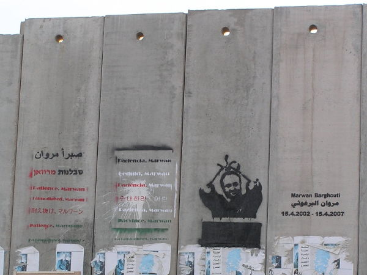

 <a href="../index.md">HOME</a> | <a href="../pages/latest.md">LATEST</a> | <a href="../pages/agitation/index.md">CAMPAIGNS</a> | <a href="../pages/glossary/index.md">GLOSSARY</a>

<h2>News & Analysis &gt; <a href="../news/all/index.md">All</a></h2>

<i>News & analysis from Proletarian Internationalist Notes&mdash;news, reviews and analysis from a global perspective</i>

### Free Marwan Barghouti, oppose the United $nakes

October 10, 2016

In a few days it will have been fourteen years and six months since Marwan Barghouti was kidnapped by an I$raeli settler goon squad in Ramallah. Enough.

Free Marwan Barghouti.

It might seem like an easy, even potentially opportunist thing to say. Al-Aqsa Intifada hero and Palestinian Legislative Council member Marwan Barghouti, who in Hebrew accurately called emself "a fighter for peace for both peoples" in a kangaroo court following eir abduction, is so popular in the Palestinian nation.<a class="note-ref" href="#user-content-note1" name="user-content-noteref1">(1)</a> A variety have called for the Fatah leader's release from what is now nearly a decade and a half of I$raeli imprisonment. That includes former MP Martin Linton in the Guardian more than two years ago and other British MPs<a class="note-ref" href="#user-content-note2" name="user-content-noteref2">(2)</a>, Azanian archbishop Desmond Tutu<a class="note-ref" href="#user-content-note3" name="user-content-noteref3">(3)</a> and other Nobel Peace Prize laureates, alleged Quisling international figure Mahmoud Abbas<a class="note-ref" href="#user-content-note3" name="user-content-noteref4">(4)</a>, different current and former Israeli officials over the years<a class="note-ref" href="#user-content-note5" name="user-content-noteref5">(5)</a>, and Arab allies of the United States<a class="note-ref" href="#user-content-note6" name="user-content-noteref6">(6)</a> whose status as allies some Americans dispute. Many former heads of state, foreign ministers or deputies appear on a list of people supporting the release of Palestinian prisoners including Barghouti.<a class="note-ref" href="#user-content-note7" name="user-content-noteref7">(7)</a>

It was noted months ago that Israeli media broadly was discussing Barghouti as a replacement for Abbas.<a class="note-ref" href="#user-content-note8" name="user-content-noteref8">(8)</a> After news of Abbas' brief hospitalization a few days ago, the Associated Press had an article discussing several "possible successors to Palestinian President Abbas" in some detail. The AP article appeared not only on Gulf News and the website of Hamodia -- a newspaper influential with Haredim, a significant group of religious Jews -- but also on the ABC News, Fox News and Washington Post Amerikan news sites.<a class="note-ref" href="#user-content-note9" name="user-content-noteref9">(9)</a>

Yes, in other words, some readers of Fox News were more aware of Marwan Barghouti a few days ago than Western liberals focused on the spectacle of how amerikans ignore "issues" and are influenced to give certain amerikans political jobs through style and the deployment of forms of pornography discussed more than a decade ago.<a class="note-ref" href="#user-content-note10" name="user-content-noteref10">(10)</a> It's not that Fox News is progressive, or that Clinton or Trump would be better for the world (apart from how much one or the other may or may not hurt AmeriKKKans' image). This is just a statement about culture and politics in the United $nakes in general and people who may be influenced by them. The people suggesting it is just Fox News, and organizations/people like it, that are the problem are themselves part of a problem. Whether they can fix themselves is up to them.

While denouncing Abbas and rejecting non-amerikans' efforts in diplomacy in the last several weeks, several supposedly pro-Palestinian websites have had nothing to say about Marwan Barghouti recently, or in the last few days despite the coverage of Abbas' health, a recent setback in national reconciliation efforts, and the looming fifteenth anniversary of Barghouti's abduction half a year from now. So some people have to hear about Barghouti by reading mainstream corporate news sources, some of whose subscribers show more concern for world affairs than lazy-ass amerikans using tone, style and appearance to choose leaders regardless of even abortion, climate change and gun control views for example. In some cases and in various ways, trying to help Clinton, who is clearly winning, make amerikkkans look good is taking time and resources away from real struggles.

So it might seem like a too-easy thing to consider Marwan Barghouti, but Barghouti represents what many disagree with or don't really support. Barghouti still stands for the two-state solution more than ey stands for the two-people or I$raeli one-state solution. Barghouti stands for national reconciliation and tactical flexibility, not permanently limiting Palestine's diplomatic capability and opposing recognition of Palestine as a state. Barghouti symbolizes not integration, but national liberation, ending occupation, and independence. Barghouti opposes coexistence with occupation and exemplifies peace efforts involving lawful militancy -- an attitude represented in Palestinian public opinion. Even as Barghouti has reportedly expressed skepticism regarding "negotiations" recently, ey supported "maintaining our national constants" and referred to Palestine's existing nationhood repeatedly.<a class="note-ref" href="#user-content-note11" name="user-content-noteref11">(11)</a> Barghouti has in the past opposed negotiations and called for an end to coordination with Israel while nonetheless supporting Palestinian statehood recognition steps that the united $tates opposed.<a class="note-ref" href="#user-content-note12" name="user-content-noteref12">(12)</a> Not all diplomacy involves negotiating with the Israelis or the amerikans. Barghouti has criticized aspects of the Arab Peace Initiative (API), but eir emphasis on national reconciliation, for example, could be viewed as friendly to non-Palestinian Arab proposals leading to a two-state outcome with improved ties with Israel. The recent postponement of local elections in Palestine is a setback from a variety of perspectives, including ones either critical or supportive (or both) of the API.

According to surveys, a plurality of Palestinians in the Gaza Strip and the West Bank would want Barghouti to be President if there were a presidential election, as opposed to any other possible candidate. The percentages in the latest PSR poll (see <a href="#user-content-note1">note 1</a>) who would want somebody other than Barghouti or Hamas' Ismail Haniyeh, if Mahmoud Abbas didn't nominate emself, only add up to 25.3%. Many individuals were named, some belonging to the same party. If all of that 25.3% were added to Haniyeh's 19.0%, the 44.3% total would only be about seven points higher than Barghouti's 37.1%. There is nothing "unclear" about what that means unless one thinks Dahlan, Erekat and Hamdallah supporters, for example, would all vote for a non-Fatah candidate. If Palestinians were allowed to elect Barghouti still in prison, it would still help the Palestinian cause in diplomacy and public opinion. And, as much as some disturbingly act like these millions of people don't exist, cross-checking shows a majority of Palestinians are still supportive of the two-state solution in one way or another, such as by supporting a French initiative or by being "generally supportive of the peace process." That is without any definition of "the peace process" given so it could mean supporting peace efforts with less amerikan influence, as answers to questions in the same survey and other surveys indicate. Many Palestinians' views are complex yet still supportive of the two-state solution. Many Palestinians support both the two-state solution and armed struggle, for example, or view the two-state outcome as temporary. Only 5.4% of the September 22-24 survey respondents "certainly supported" abandoning the two-state solution and demanding "the establishment of one state for Palestinians and Israelis."

Nevertheless, you have allegedly pro-Palestinian activists, influenced by (other) Westerners, who chastise Abbas in front of a global audience for supposedly not condemning knife attacks, but they oppose the two-state solution and diplomacy whether they conflict with what the amerikans want or not and whether Palestinians support them or not. It is common to hear about the "death" of the two-state solution, which the united $tates obstructs despite appearing to work on it sometimes. It is possible to conciliate with u.$. hegemony by publicly expressing too much fatalistic skepticism toward the two-state solution in general. Many energetically declare the supposed manifest non-viability of Palestinians' aspirations for independent national sovereignty, and in doing so some conspire with amerikans and certain right-wing Zionists even as they rhetorically support liberation from "the river to the sea." In fact, if the two-state solution is becoming inviable and diplomacy is going to die as well, it is partly because some -- supporting integrationism for Palestine or upholding some pseudo-leftist notion of global socialist revolution before u.$. hegemony ends -- are trying to remove the life support and keep the doctor locked out of the hospital. Until it is free, the Palestinian nation will always want national liberation, though.

It is not for devoted readers of the Washington Post et al. to be choosing the Palestinians' president for them, but there is no reason anyone in the West should be opposing Barghouti's release or supporting illegal imprisonment, in I$raeli settler entity prisons, of Palestinian resisters to occupation. Barghouti's freedom is a matter of respecting Palestinian national self-determination and the law. Even many Palestinian political competitors of Barghouti recognize that. It doesn't mean they can't try to beat Barghouti in an election. Palestinians need international support for their ability to choose various things even as they debate them internally.

Anecdotally speaking, this writer has come across supporters of Israel boycotts who literally didn't know who Marwan Barghouti was or are more likely to know who Omar Barghouti is. One would think this writer surrounds emself with people who don't have the Internet and are illiterate, but everyone including the present writer should take more responsibility for correcting this. Systematically, one can search for "Marwan Barghouti" on various websites and compare the results with other searches on the same sites. Given the role Barghouti could play in literally changing the course of world history, there are fewer references to Barghouti than there should be in comparison with other individuals who are considerably less important. Discussion of Barghouti can be observed in many places and settings, but it appears that even if some learned about Barghouti they would still not support Barghouti's release in earnest. Yet, Barghouti reportedly supports BDS, and a massive campaign to free Barghouti or support an election bid arguably would do more in the short term for the Palestinian cause than BDS. That is unless Barghouti's release becomes a more prominent, explicit demand of the BDS movement itself.

There may be considerations of timing involved in some boycott supporters' attitude toward Barghouti's imprisonment. As the fifteenth anniversary of Barghouti's abduction approaches, though, it increasingly seems such possible excuses are unlikely to withstand scrutiny.

Arab, Islamic, non-Western and second-rate-European states' economic renegotiation, diplomacy and signaling to other states, Israel, and the world -- in the midst of economic crisis and weaknesses in amerikan ties and influence -- have been discussed in the media and on this site. It is difficult for some to understand the diplomatic and commercial aspects of international class struggle. This writer doesn't expect everyone to understand the diplomatic element, and the need to give space to it, even after exhaustive discussion. Hopefully, more can understand the need to free Marwan Barghouti immediately. It is another way of approaching some of the same problems involved. Maybe some don't understand how they can support diplomacy in other terms, but "free Marwan Barghouti" may inspire more concrete understanding and action.

Other Arab states are supposedly pressuring Abbas to support somebody like Mohammed Dahlan or Arafat's nephew Nasser al-Kidwa as a replacement.<a class="note-ref" href="#user-content-note13" name="user-content-noteref13">(13)</a> Dahlan is already well-known to, yet not preferred by, various people. 4.7% of Palestinians in the Gaza Strip and the West Bank, considered as a whole, would want Dahlan to be President after Abbas lets go. That isn't significantly different from the 5.3% for Hamas' Khaled Meshaal. Al-Kidwa (al-Qudwa) has a strong foreign affairs/diplomatic background like Abbas and for that reason, and others, would be viewed negatively by many of those now condemning Abbas. Marwan Barghouti strongly supported the Oslo Accords at one point, but has been involved in the mass resistance side of things more than some others.

There could be a case of trying to have things both ways. Those who want Abbas to resign now should support Barghouti's release. Those who don't want somebody to be Palestine's president, or unelected international figure, who is supported by Arab states should support Barghouti's release. Those who don't, show a lack of seriousness regarding Palestinian self-determination, and they exhibit disrespect for the exploited working class' struggle in national form. Palestine is a proletarian nation, and right now it is saying it wants Barghouti even if Barghouti would end up as a bureaucratic figure not too different from Abbas. Abbas is known as somebody perhaps overly comfortable with diplomatic and political work, but Abbas was a member of the PLO and Fatah for years before imperialists stopped calling those organizations "terrorist."

All of the people outside Palestine complaining about Abbas' attendance at Shimon Peres' funeral at the end of September had better be supporting Barghouti's release. Whatever their problems -- and indeed some are serious -- it is clear Abbas and Peres had said more words in support of Barghouti's release than some others in the past. Abbas has done more to support Barghouti's release than some who seem to avoid mentioning Barghouti today even after years of activists' and figures' calling for Barghouti's release on a non-sectarian basis.

In New York last month, at the General Debate of the UN General Assembly, Abbas said Israel "must release the thousands of our prisoners and detainees." But Abbas didn't name Barghouti specifically. Abbas can be criticized for not doing enough for Barghouti and Palestine, but such a criticism only makes sense if one supports Barghouti's release.

In addition to Palestinians themselves, some of those who fought against apartheid in Azania had supported giving the Nobel Peace Prize to Barghouti before Colombian President Juan Manuel Santos won it days ago. Israel may not have a "de Klerk," but there is no reason the Palestinians should not have their "Mandela" back with them outside the Green Line. Although, anticolonialists throughout history have supported boycotts, and Barghouti is less similar in some respects to Nelson Mandela than one might think. Barghouti's discourse is more one of national liberation, national unity, and national independence, and less a discourse of anti-racism and civil rights within a single country. Those who talk about apartheid or settler-colonialism in Palestine and yet have difficulty supporting Barghouti's release from an I$raeli prison should ponder why that is. "Who is selling out whom, and for what," is a question even some of those highly critical of both Fatah and Hamas should be asking themselves.

The prospects for Barghouti's release are arguably worse at the moment than they were at certain points during George W. Bush's presidency. There have been almost fifteen years of chances for the united $tates to support Barghouti's release, half of those under Obama, who accepted a Nobel Peace Prize and went on to start military operations in several Arab countries. At some point, to suggest -- as some have suspiciously done -- that the united $tates has an particular interest in Barghouti's release, as a reason not to support it, becomes delusional in the extreme. If the united $tates had wanted Barghouti out of prison, Barghouti would be free already.

The amerikans may not support Barghouti's release -- because they don't care about whether there is peace in the Middle East or not as long as their interests are served -- but Israelis have an interest in Barghouti's freedom. If nothing else, there are economic reasons. As long as there is not an independent and sovereign Palestinian state, Israel will still be subject to state-level boycotts by Arabs. The Arab boycotts of Israel benefit Palestine even if the State of Palestine doesn't officially endorse and enforce a total economic boycott of Israel, but the Israeli entity and Palestine can both benefit economically by reaching an understanding. Growing the Israeli economy by tolerating political conditions favorable to the Israeli arms industry is no longer as strong a strategy as it used to be. Israel in September accepted a new ten-year aid package that favored the u.$. arms industry by further limiting spending on Israeli weapon systems and equipment. The record-setting deal emboldens some shortsighted Israelis, but releasing Barghouti may actually make more economic sense now. Holding out for somebody to come along who is more acceptable than Marwan Barghouti, or Ismail Haniyeh, to both Israelis and Palestinians is unrealistic.

Now that the Nobel committee has declined to award Barghouti the Peace Prize, what happens or doesn't happen during the next six months will be critical. Israelis and people around the world must come to their senses and support Marwan Barghouti's freedom for the sake of peace and prosperity even if the dominant united $nakes is content with the status quo. &loz;

<b>See:</b> 
&bull; "Sending the right signal: Abbas, BDS, and diplomacy," 2016 October. <a href="https://github.com/pinotes/pinotes.github.io/blob/master/_posts/2016-09-29-news-Abbas-BDS-diplomacy.md" target="_blank">https://github.com/pinotes/pinotes.github.io/blob/master/_posts/2016-09-29-news-Abbas-BDS-diplomacy.md</a> 
&bull; "Palestinians back Marwan Barghouti for Nobel Prize," 2016 April 13. http://www.aljazeera.com/news/2016/04/palestinians-marwan-barghouti-nobel-prize-160413193700928.html 
&bull; "Palestinians campaign to nominate Barghouti for Nobel Peace Prize," 2016 April 14. http://presstv.ir/Detail/2016/04/14/460663/Palestinians-campaign-Marwan-Barghouti-Nobel-Peace-Prize/ 
&bull; "Tutu backs Barghouti for Nobel Peace Prize," 2016 June 9. http://saudigazette.com.sa/world/mena/tutu-backs-barghouti-nobel-peace-prize/ 
&bull; "Page by page, Marwan Barghouti's anti-war tome walked out of prison," 2011 December 23. http://www.thenational.ae/arts-culture/books/page-by-page-marwan-barghoutis-anti-war-tome-walked-out-of-prison 
&bull; "Israel places jailed Hamas commander in solitary confinement," 2015 May 31. http://presstv.ir/Detail/2015/05/31/413713/Israel-Barghouti-Palestine-Hamas-Fatah- 
&bull; "A former spy chief is calling on Israelis to revolt," 2016 October 1. http://www.haaretz.com/israel-news/.premium-1.745072 
&bull; "Pollard opposes releasing Barghouti," 2006 April 16. http://www.jpost.com/International/Pollard-opposes-releasing-Barghouti 
&bull; "Amos Oz calls for Barghouti's release in book dedication," 2011 March 15. http://www.jpost.com/Breaking-News/Amos-Oz-calls-for-Barghoutis-release-in-book-dedication 
&bull; "Belgian lawmakers nominate jailed Palestinian Barghouti for Nobel," 2016 May 18. http://www.timesofisrael.com/belgian-lawmakers-nominate-jailed-palestinian-barghouti-for-nobel/ 
&bull; "Arab Parliament supports Barghouthi as Nobel nominee," 2016 April 18. http://alray.ps/en/?act=post&id=7188 
&bull; "Erekat backs Marwan Barghouti as next Palestinian president," 2016 February 20. http://www.jpost.com/Arab-Israeli-Conflict/Erekat-says-he-supports-Marwan-Barghouti-as-next-Palestinian-president-445540

<b>Notes:</b> 
<a class="note-no" href="#user-content-noteref1" name="user-content-note1">1.</a> "Waiting and impatience: Palestine, WikiLeaks release timing, and persistent belief in change in AmeriKKKa," 2016 October. <a href="https://github.com/pinotes/pinotes.github.io/blob/master/_posts/2016-10-09-news-Palestine-WikiLeaks-election-public-opinion.md" target="_blank">https://github.com/pinotes/pinotes.github.io/blob/master/_posts/2016-10-09-news-Palestine-WikiLeaks-election-public-opinion.md</a> 
"Palestinian Public Opinion Poll No (61)," 2016 September 27. http://www.pcpsr.org/en/node/668 
http://www.pcpsr.org/sites/default/files/Poll-61-English%20Full%20Text%20%20desgine.pdf 
<a class="note-no" href="#user-content-noteref2" name="user-content-note2">2.</a> "Release Marwan Barghouti. He can be Palestine's Nelson Mandela," 2014 March 28. https://www.theguardian.com/commentisfree/2014/mar/28/release-marwan-barghouti-palestines-nelson-mandela 
"British MPs' plea to release Marwan Barghouthi after 14 years," 2016 April 15. http://english.pnn.ps/2016/04/15/british-mps-plea-to-release-marwan-barghouthi-after-14-years/ 
<a class="note-no" href="#user-content-noteref3" name="user-content-note3">3.</a> "Desmond Tutu supports call for the release of Palestinian prisoners," 2013 October 27. http://mg.co.za/article/2013-10-27-tutu-calls-for-the-release-of-palestinian-prisoners/ (https://web.archive.org/web/20140825035549/http://mg.co.za/article/2013-10-27-tutu-calls-for-the-release-of-palestinian-prisoners) 
<a class="note-no" href="#user-content-noteref4" name="user-content-note4">4.</a> "Abbas calls for the release of Marwan Barghouti and other prisoners," 2014 March 21. http://www.asianews.it/news-en/Abbas-calls-for-the-release-of-Marwan-Barghouti-and-other-prisoners-30622.html 
"Barghouti's wife accuses PA of obstructing his release ," 2011 June 18. http://www.jpost.com/Middle-East/Barghoutis-wife-accuses-PA-of-obstructing-his-release 
<a class="note-no" href="#user-content-noteref5" name="user-content-note5">5.</a> "Minister Ezra calls to release Barghouti," 2007 February 5. http://www.jpost.com/Israel/Minister-Ezra-calls-to-release-Barghouti 
"MK Cabel calls for the release of Marwan Barghouti," 2007 June 20. http://www.jpost.com/Israel/MK-Cabel-calls-for-the-release-of-Marwan-Barghouti 
"Israeli minister calls for release of Barghouti," 2007 September 25. http://www.pravdareport.com/news/world/25-09-2007/97675-israel_palestinian-0/ 
"Peretz to begin 'free Barghouti' drive," 2008 April 3. http://www.jpost.com/Israel/Peretz-to-begin-free-Barghouti-drive 
"Growing support for Barghouti's release," 2009 August 11. http://www.jpost.com/Israel/Growing-support-for-Barghoutis-release 
<a class="note-no" href="#user-content-noteref6" name="user-content-note6">6.</a> "Egyptian FM: We are committed to freeing Marwan Barghouti from Israeli prison," 2016 April 17. http://www.jpost.com/Arab-Israeli-Conflict/Egyptian-FM-We-are-committed-to-freeing-Marwan-Barghouti-from-Israeli-prison-451470 
<a class="note-no" href="#user-content-noteref7" name="user-content-note7">7.</a> "The most prominent signatories of the Robben Island Declaration finally revealed," 2014 June 12. http://fmaapp.org/days-before-the-12th-anniversary-of-his-arrest-the-world-calls-for-the-release-of-marwan-barghouthi-and-all-palestinian-prisoners/ (https://web.archive.org/web/20140612072754/http://fmaapp.org/days-before-the-12th-anniversary-of-his-arrest-the-world-calls-for-the-release-of-marwan-barghouthi-and-all-palestinian-prisoners/) 
<a class="note-no" href="#user-content-noteref8" name="user-content-note8">8.</a> "Boycott the United Snakes: Amerika standing in the way of the two-state solution," 2016 July. <a href="https://github.com/pinotes/pinotes.github.io/blob/master/_posts/2016-07-15-news-Boycott-United-States.md" target="_blank">https://github.com/pinotes/pinotes.github.io/blob/master/_posts/2016-07-15-news-Boycott-United-States.md</a> 
<a class="note-no" href="#user-content-noteref9" name="user-content-note9">9.</a> "A look at possible successors to Palestinian President Abbas," 2016 October 7. http://m.gulfnews.com/news/mena/palestine/a-look-at-possible-successors-to-palestinian-president-abbas-1.1908568 
"FOCUS: Possible Successors to Palestinian Leader Mahmoud Abbas," 2016 October 7. http://hamodia.com/2016/10/07/focus-possible-successors-to-palestinian-leader-mahmoud-abbas/ 
https://www.washingtonpost.com/national/a-look-at-possible-successors-to-palestinian-president-abbas/2016/10/07/1c9d55d6-8c55-11e6-8cdc-4fbb1973b506_story.html 
https://abcnews.go.com/International/wireStory/successors-palestinian-president-abbas-42635792 (https://web.archive.org/web/20161007085149/http://abcnews.go.com/International/wireStory/successors-palestinian-president-abbas-42635792) 
http://www.foxnews.com/world/2016/10/07/look-at-possible-successors-to-palestinian-president-abbas.html (https://web.archive.org/web/20161008160904/http://www.foxnews.com/world/2016/10/07/look-at-possible-successors-to-palestinian-president-abbas.html) 
"Fatah and Hamas: the new Palestinian factional reality," 2006 March 3. https://web.archive.org/web/20161011060528/http://www.dtic.mil/dtic/tr/fulltext/u2/a458970.pdf 
<a class="note-no" href="#user-content-noteref10" name="user-content-note10">10.</a> "Was Monicagate a Christian fascist power grab or pornography?" 2006 January 17. https://web.archive.org/web/20081006072402/http://www.etext.org/Politics/MIM/wim/wyl/general/mimongendervsothers.html 
<a class="note-no" href="#user-content-noteref11" name="user-content-note11">11.</a> "Towards generating a new Palestinian political elite," 2016 March 23. https://www.middleeastmonitor.com/20160323-towards-generating-a-new-palestinian-political-elite/ (https://web.archive.org/web/20161012020131/https://www.middleeastmonitor.com/20160323-towards-generating-a-new-palestinian-political-elite/) 
See: "Israel's cruelty has unleashed an intifada of individuals," 2015 October 31. http://www.thenational.ae/opinion/comment/israels-cruelty-has-unleashed-an-intifada-of-individuals "As jailed Palestinian leader Marwan Barghouti wrote this month: "We cannot coexist with the occupation, and we will not surrender to it ... For generation after generation, the Palestinian people have proven their will is unbreakable."" 
<a class="note-no" href="#user-content-noteref12" name="user-content-note12">12.</a> "Jailed Palestinian leader Barghouti urges resistance," 2012 March 27. http://www.bbc.co.uk/news/world-middle-east-17522781 
"Jailed Palestinian Leader Marwan Barghuti in solitary confinement after call for peaceful resistance," 2012 April 2. http://www.ibtimes.co.uk/jailed-palestinian-leader-solitary-confinement-call-peaceful-322695 
<a class="note-no" href="#user-content-noteref13" name="user-content-note13">13.</a> "Will Abbas reconcile with Hamas over Dahlan?" 2016 October 4. http://www.al-monitor.com/pulse/originals/2016/10/palestinian-abbas-arab-pressure-dahlan-hamas-reconciliation.html 
"Arafat's nephew said tapped to lead PA after Abbas," 2016 October 6. http://www.timesofisrael.com/arafats-nephew-said-tapped-to-lead-pa-after-abbas/

_____________________________________ <a href="../index.md">home</a> | <a href="../pages/latest.md">latest</a> | <a href="../pages/agitation/index.md">campaigns</a> | <a href="../reviews/movies/index.md">movie reviews</a> | <a href="../pages/newsletter/index.md">newsletter</a> 

